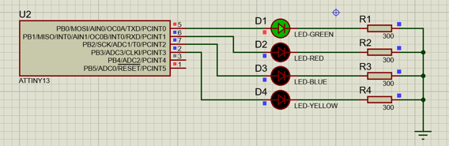

# Lab1 Fizz Buzz

The classic game `Fizz Buzz` in embedded systems. The consists of a counter counting range 0 => 1000

## Components

- ATTINY13 AVR microcontroller
- GREEN, RED, BLUE and YELLOW LEDs.
- 4 current limiting resistors

## Implementation

- If the counter's value is divisible by 3, only GREEN LED is turned on.
- If the counter's value is divisible by 5, only RED LED is turned on.
- If the counter's value is divisible by both 3 and 5, only BLUE LED is turned on.
- If the counter's value is neither divisible by 3 nor 5, only YELLOW LED is turned on.
- The counter is reset to zero If the counter is greater than 100.

## screenshot

