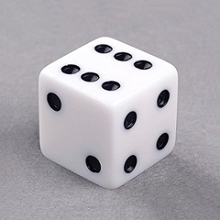
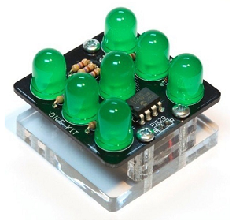
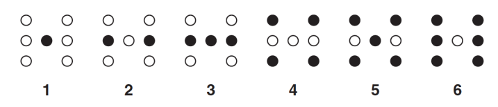
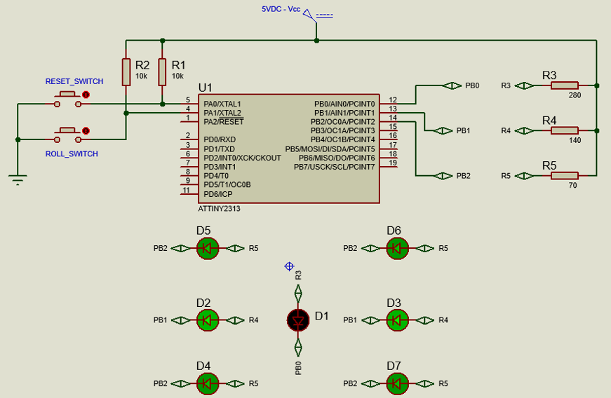

# Lab2 Electronic Dice

The Electronic Dice is the implementation of regular dice using electronic devices.
The device consists of two input switches. once switch one(ROLL switch) is pressed, the user is shown a random number between 1-6. On pressing Switch two (RESET switch) the output (number displayed) is cleared.

---

| Regular Dice          | Electronic Dice       |
|-----------------------|-----------------------|
| | 

---

## Components

- ATtiny2313 AVR microcontroller.
- 7 LEDs
- 2 Push Button switches
- Current limiting resistors

## Functionality

- Initially turn off all LEDs
- if the RESET switch is pressed, turn off all LEDs
- if the ROLL switch is pressed, a. clear the output b. wait for one second c. generate a random number d. turn on the LEDs corresponding to the random number.

## screenshot

