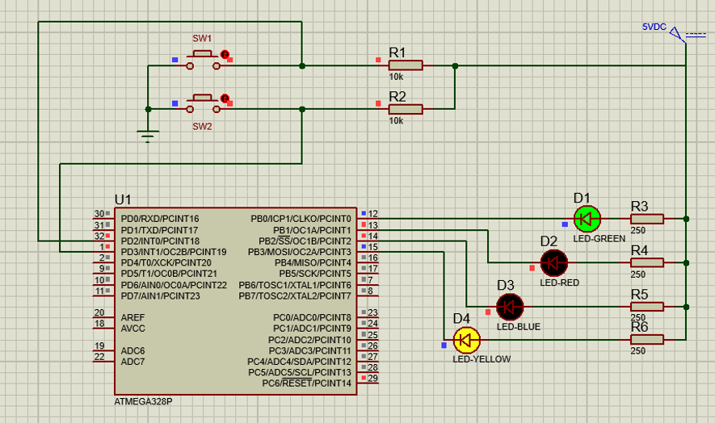

# Lab3 Timers and Interrupts tutorial

Unlike lab-1 and lab-2, this tutorial accomplishes changing the logic flow of instructions to carry out brief and higher priority tasks using timers and interrupts.
***This work requires use of the official [ATMega328P datasheet](https://ww1.microchip.com/downloads/en/DeviceDoc/Atmel-7810-Automotive-Microcontrollers-ATmega328P_Datasheet.pdf)**

## Components

- GREEN, RED, BLUE and YELLOW LEDs.
- ATMega328P AVR microcontroller.
- Two push button switches.
- Current limiting resistors.

## Functionality

- Initially, all LEDs are OFF.
- GREEN and YELLOW LEDs blink continuously at 1Hz.
- While SWITCH 1 is pressed, RED LED is turned and stays ON until the SWITCH 1 is released.
- While SWITCH 2 is pressed and then released, turn ON BLUE LED for one second and turn it OFF.

## screenshot

